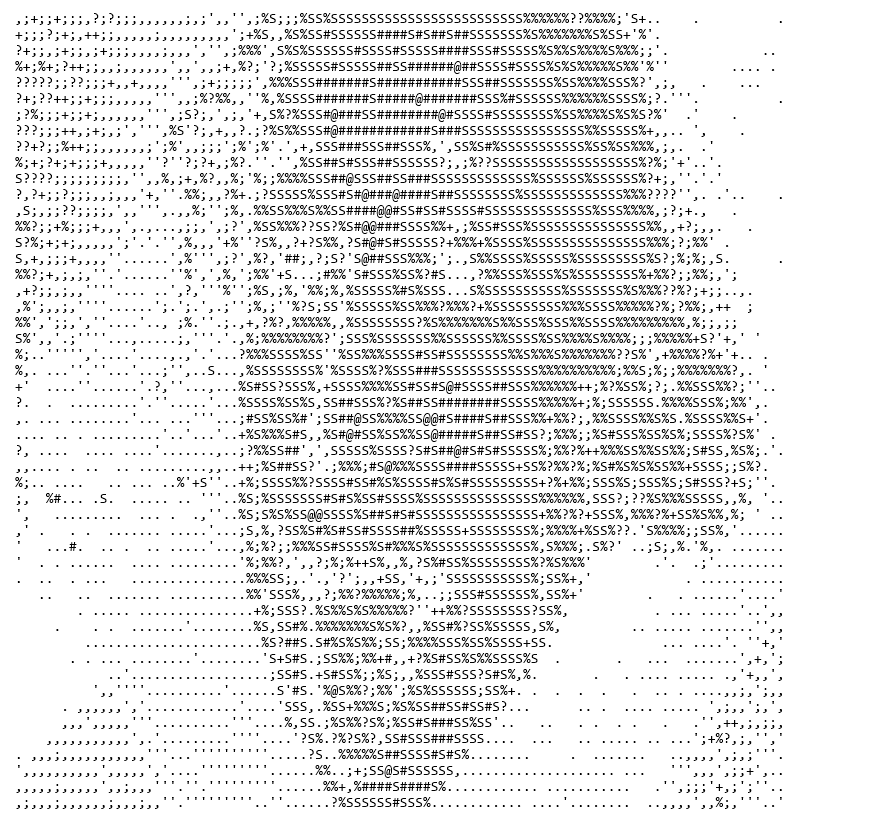

# HW2 GPG 簽章驗證與檔案輸出

完成與繳交日期：2026-10-05。

這份作業依照[課程講義](https://hackmd.io/NkCXD6syQmCrmFWMiEsaHg)中的「HW2/LAB: Decrypt the signed file」，使用老師提供的公開金鑰驗證 `ascii-art.gpg`，並取出裡面的 ASCII 字元圖。

## 操作步驟

本次使用 Windows 上 Git for Windows 附帶的 GnuPG 2.4.9。以下指令可在 Git Bash 中，於本作業的 `hw2` 目錄執行；如果已有同名輸出檔案，GPG 會詢問是否覆寫。

先建立存放檔案的目錄：

```bash
mkdir -p input output
```

下載老師提供的兩份檔案，分別存成 `input/ascii-art.gpg` 與 `input/public-key.key`：

- [簽章檔案 ascii-art.gpg](https://github.com/cnchenpu/SysSec-pub/raw/main/sec101/ascii-art.gpg)
- [公開金鑰 public-key.key](https://raw.githubusercontent.com/cnchenpu/SysSec-pub/main/sec101/public-key.key)

接著建立獨立的金鑰目錄，匯入公開金鑰：

```bash
gpg_home="$(mktemp -d)"
gpg --homedir "$gpg_home" --import input/public-key.key
```

取出內容並驗證簽章，再顯示驗證訊息與輸出的文字：

```bash
gpg --homedir "$gpg_home" --no-auto-key-retrieve \
  --status-file output/gpg-status.txt \
  --output output/ascii-art.txt --decrypt input/ascii-art.gpg \
  2> output/gpg-verification.txt
cat output/gpg-verification.txt
cat output/ascii-art.txt
```

## 執行結果

GPG 回傳碼為 `0`，輸出的文字檔共 **4,940 bytes、50 行**。狀態紀錄中出現 `GOODSIG` 與 `VALIDSIG`，表示檔案簽章與匯入的公開金鑰相符。

```text
gpg: Good signature from "testid <testid@gmail.com>" [unknown]
Primary key fingerprint: CD5E FDA4 EC66 9CDD 8F5A 7142 0805 311C D398 A20A
```

下圖是將輸出文字以等寬字型繪成的圖片，方便在網頁閱讀。原始文字沒有更動，圖片並非終端機截圖。



- [完整輸出文字](output/ascii-art.txt)
- [GPG 驗證訊息與信任警告](output/gpg-verification.txt)

## 簽章與加密的差別

題目使用 decrypt 一詞，指令也用了 `--decrypt`。檢查檔案後，可以看到壓縮、one-pass signature、literal data 與 signature 封包，沒有加密資料封包。因此，這次操作是取出帶有簽章的內容並驗證簽章，不需要私鑰或密碼。公開金鑰在這裡用來驗證簽章，不能用這個結果推論它能解開一般的機密密文。[GnuPG 手冊](https://www.gnupg.org/gph/en/manual.html)的 Making and verifying signatures 一節也有說明這種用法。

驗證時也出現 `TRUST_UNDEFINED` 與「This key is not certified with a trusted signature」警告，因為這個環境尚未確認金鑰與持有者真實身分的關係。簽章比對成功與身分是否可信，是兩件需要分開判斷的事。本次保留原始警告，沒有調整信任設定。

檔案中的簽署日期是 2021-04-25；本次執行與驗證的日期是 2026-10-05。
